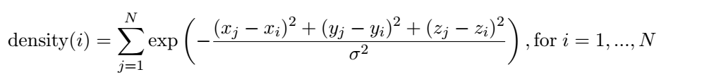
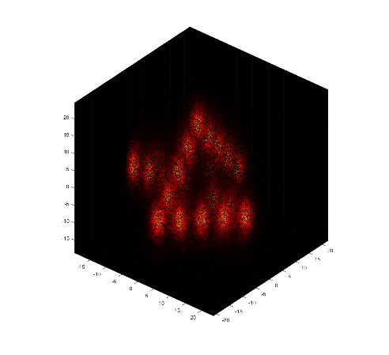

# 3D_SMLM_visualization

SMLM datasets are point clouds in 2D or 3D space (list of coordinates).
The most suitable way of visualizing this kind of data in MATLAB is the density-colored scatter plot. The advantage of scatter plot in MATLAB is that once you plot it, moving/panning/zooming/rotating is pretty fast compared to other kind of visualizations. The disadvantage however, is that you cannot define transparency parameter for each point that is rendered. Therefore, cluttering is unavoidable.
This is however computationally challenging as one need to compute the density at each single point (or localization).   
```matlab
scatter3(x, y, z, 1, color_vector, '.');
```
where `x`, `y`, `z` and `color_vector` are all Nx1 vectors and `color_vector` represents the density at each (x,y,z) coordinate.  

In this project, I computed the density at each single point (localization) by computing the sum of the exponential distances of the point of interest to all the other points (localization).



where density `= color_vector` and sigma acts as a sort of smoothing parameter. The direct computation of these distances, however, is very time consuming especially for very large point clouds or SMLM data (>1000).

In order to speed-up the computational time, I used the Fast Gauss Transform in order to compute all pair-wise distances. This is followed by summing up all distances for the localization of interest.

For Fast Gauss Transform, there are many different implementations. I used [Morariu](https://github.com/vmorariu/figtree)'s  implementation which has a MATLAB wrapper that can easily be compiled (it works for me with MATLAB 2015-2017).
The subdirectory FGT links to the original github repository.

Once you download the above library and compile the required mex files, you can run script.m in order to visualize 3D SMLM datasets.

In data folder, I have provided a 3D simulated SMLM particle which you can try. It contains ~300k localization and on my machine it takes 15 seconds to be plotted. The following is a side-view of this particle:

